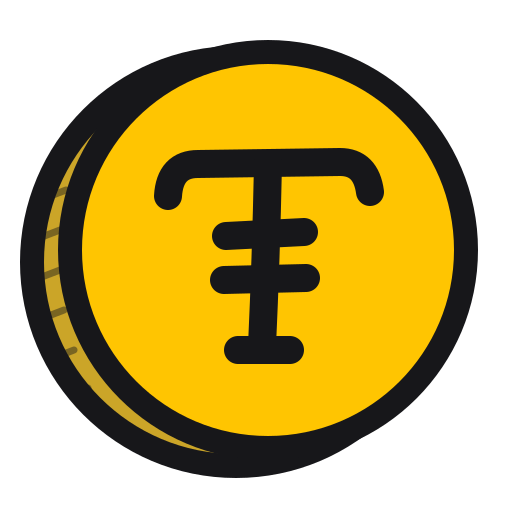

<h1 align="center">
  
  &nbsp;tokenomics
</h1>

<p align="center"><b>Spend the expensive model only where it's worth it, and stop paying twice for what you already decided.</b></p>

<p align="center">
<a href="https://github.com/slopstopper/tokenomics/releases"></a>
<a href="https://github.com/slopstopper/tokenomics/actions/workflows/gates.yml"></a>
<a href="LICENSE"></a>
</p>

Most people who work with AI models reach for the strongest one for everything. Not because every task needs it, but because it is hard to tell which ones do. The brainstorm needs it. The formatting pass afterwards doesn't, but the session is already open on the expensive model, so the work carries on there. Spend leaks in quieter ways too: a subagent dispatched without naming a model inherits the most expensive one; a session that re-reads the repository to find its place pays again for work it already did; a context that grows for hours starts to drift, and the drift costs more turns to fix.

tokenomics is a method for matching the model to the work, and a Claude Code plugin that applies it. Each task is routed before it starts, by what it would cost to get wrong and whether your checks would catch it. Work that moves from an expensive tier to a cheaper one moves on a written handoff spec, so the cheaper tier doesn't re-derive what was already decided. Between sessions, a living playbook carries what you worked out, instead of re-exploration. And at every boundary the working context is deliberately left behind: only the distilled result crosses, which keeps each context tighter, cheaper, and less prone to drift.

It's worth it if some of your model calls cost more than others and your work runs across more than one session.

## Let's get tokenomical

From inside Claude Code:

```
/plugin marketplace add slopstopper/marketplace
/plugin install tokenomics@slopstopper
```

Then run `tokenomics-bootstrap`. It asks about your model tiers, your limits and your project's checks, and writes the playbook every future session opens on. Updates arrive through `/plugin`. (The repository is also its own marketplace, if you want tokenomics alone: `/plugin marketplace add slopstopper/tokenomics`, then `/plugin install tokenomics@tokenomics`.)

Not using Claude Code? The [method](reference/portable-method.md) and the two templates in `reference/` are plain markdown, so they work with any model or tool: keep the playbook next to your project and run the routing and handoffs by hand.

## How work gets routed

In v0.4, a task's lane comes from one question:

> **"If this is done slightly wrong, is it expensive?"** Yes → flagship. Clear contract with tests → mid. Mechanical with automated checks → small.

And one limit on how far down is safe: **route down only as far as your gates reach.** If checking the work means redoing it, it belongs with the expensive model even when it looks easy, because the wrong version reads exactly like the right one.

When a cheaper model finds it's out of its depth, it stops and hands back early with what it tried, rather than grinding on and quietly spending what the routing saved.

v0.5 widens this to three questions and four classes of work (see [what's next](#whats-next)).

## What's in the box

- **tokenomics-method** teaches the method. Takes no actions.
- **tokenomics-bootstrap** sets a project up: interviews you and writes the playbook. It invents nothing; if you arrive mid-project with a pile of notes, they go in word for word.
- **tokenomics-handoff** works at the moments that matter: routing a task, writing the handoff spec a cheaper model can execute without re-deriving anything, and closing a session with one line in the ledger.
- The [method](reference/portable-method.md), the playbook and handoff-spec [templates](reference/), two worked [examples](examples/), and an opt-in [Claude Code adapter](adapters/claude-code/README.md) with a hook that opens each session on the playbook.

## The small print

- It's a practice report from one real project, not a benchmark. Savings haven't been measured yet; the spend ledger exists so that one day they can be.
- It won't switch models, clear or compact a session for you. Plugins can't; the most one can do is suggest, and those suggestions arrive in v0.5.

The failures it targets are real, though. An independent plugin, [superpowers](https://github.com/obra/superpowers), found two of them in its own runs: subagents silently inheriting the most expensive model, and work redone after compaction lost track of what was finished.

## Status

**v0.4.0** is the first tagged release: the three skills, the method with its routing test, handoff and escalation rules, the templates, the examples and the Claude Code adapter. See the [changelog](CHANGELOG.md).

## Why it exists

It started with not knowing which model to use, and it is that missing skill, written down. Hardly anyone was taught it: a flat monthly fee hid the meter, so we leave every light in the house on.

The meter isn't neutral, either. Caps, premium windows and per-token bills are shaped so the easiest answer to running short is to pay for more, and compute costs power, water and hardware whether the task needed it or not. So tokenomics isn't about spending less. It's about spending well, and deciding that for yourself instead of letting the meter decide. More in [docs/why.md](docs/why.md).

## What's next

v0.5.0 is taking shape in the open: four classes of work, one per model tier (**pathfinder, navigator, builder, keeper**), scored by three quick questions and re-scored at every boundary ([spec](docs/design/2026-10-03-routing-axes-design.md)); well-timed nudges for when to clear, compact or switch tier ([#30](https://github.com/slopstopper/tokenomics/issues/30)); and a lighter way in for people who only want the essentials ([#29](https://github.com/slopstopper/tokenomics/issues/29)).

## Feedback

Tried it on your own project? Open an [adopter-feedback issue](https://github.com/slopstopper/tokenomics/issues/new?template=feedback.yml). The shape and scale of the project are enough, and what rotted first is the most useful thing you can tell us. Contributing: [CONTRIBUTING.md](CONTRIBUTING.md).

*Tokens as in the units a model reads and writes. The coin is just for fun.*

## License

Credit-first, per the slopstopper family formula: all prose (skills, docs, the method, examples) is **CC BY 4.0**: take it anywhere, adapt it, use it commercially; the one-line credit travels with every copy. CI plumbing is Apache-2.0. The scope map and the requested attribution format live in [`LICENSE`](LICENSE). Using the plugin requires nothing: these terms bind republishing, not use. Previously published versions remain MIT.
